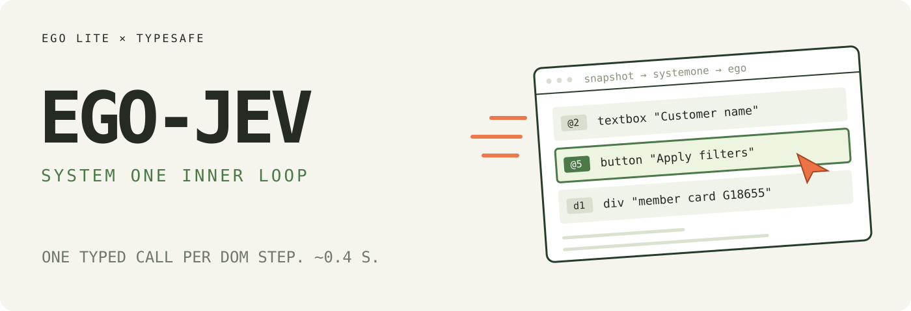

# ego-jev

[](https://skills.sh/ZephyrDeng/ego-jev)
[](https://github.com/ZephyrDeng/ego-jev/releases)
[](LICENSE)

**An agent skill that gives [ego lite](https://lite.ego.app/) a Jev
([TypeSafe System One](https://docs.typesafe.ai/introduction)) inner loop —
one ~0.4 s typed decision per DOM step instead of a full LLM turn.**

ego executes; Jev decides. Each step: snapshot → number the interactive
elements → one System One call picks the operation *and* its target together
→ ego clicks, fills, selects. Jev never writes text and never sees a
screenshot. Login, payment, free text, canvas and content reading escalate
back to the planner.

Sibling project: [jev-ultrafast](https://github.com/browser-use/jev-ultrafast)
runs the same idea as a standalone browser agent — **Zürich → London on
Google Flights in 7.1 s**. This skill brings that loop into ego lite, so the
agent keeps the user's real browser, sessions and logins.

## The loop

Every observation produces a numbered element table — a11y refs `@N` plus
DOM-discovered "dark matter" `dN` (div cards, `cursor:pointer`, iframe and
shadow content the snapshot never refs):

```text
@2  textbox   "Customer name"
@5  button    "Apply filters"
d1  div       "member card G18655"
...
```

```text
                       one System One request
                      ┌───────────────────────────┐
page → element table → operation                  │
                      │ click_target              │
                      │ fill_target               │
                      │ select_target, if present │
                      └─────────────┬─────────────┘
                           use the matching target
                                    │
                      CLICK @5 ─────┤──→ ego-browser
                      FILL  @2 ─────┘
```

Target questions are speculative: only the selected operation's target can
execute. Two decisions, **one network round trip**, and each target head
carries only role-compatible elements.

## Per step

| | |
| --- | --- |
| Jev decision (TypeSafe direct) | ~300–550 ms, 20–120 elements |
| Snapshot + DOM walk | ~20 ms |
| Tokens | ≈ 11K input ≈ $0.0005 (output free) |
| The LLM-turn alternative | seconds of reasoning + a screenshot |

| op | what runs |
| --- | --- |
| `click` / `fill` / `select` | ego `page.click` / `fill` / `selectOption` on `@N`; `dN` via tagged CSS or viewport coordinates |
| `scroll` / `wait` | reveal an element or let async content settle |
| `done` / `escalate` / `blocked` | loop exits loud — your `verify` decides if `done` is real |

Guarded targets (pay / delete / upload / confirm, EN + 中文) escalate by
default; so do login pages, free text, low confidence and repeated actions.

## Requirements

- [ego lite](https://lite.ego.app/) installed and onboarded — it provides the
  `ego-browser` command and the TaskSpace/Page runtime this skill drives.
- The `ego-browser` agent skill (TaskSpace and Page rules; ego-jev only
  replaces the per-step "which element" judgment).
- One backend key:
  - `TYPESAFE_API_KEY` from [console.typesafe.ai](https://console.typesafe.ai)
    (fastest, ~300–550 ms/step), or
  - `AI_GATEWAY_API_KEY` for Jev through the Vercel AI Gateway.
  - Put either in `~/.config/ego-jev/secrets.env` (`export NAME=value`).

## Install

```bash
npx skills add ZephyrDeng/ego-jev
```

or with the GitHub CLI:

```bash
gh skill install ZephyrDeng/ego-jev
```

## Use

Read [`skills/ego-jev/SKILL.md`](skills/ego-jev/SKILL.md) — the entry point
your agent loads. The loop itself is dependency-free Node in
[`skills/ego-jev/scripts/jev-loop.mjs`](skills/ego-jev/scripts/jev-loop.mjs);
options, thresholds, backends and latency numbers live in
[`skills/ego-jev/reference.md`](skills/ego-jev/reference.md).

```js
const { runJevLoop } = await import(`file://${SKILL_DIR}/scripts/jev-loop.mjs`);
const result = await runJevLoop(page, {
  goal: "Open the Billing page and show the credit balance",
  verify: async (p) => /billing/.test(await p.url()),
});
```

Offline smoke test (mock decider, no key, runs inside ego-browser):

```bash
cd skills/ego-jev && ego-browser nodejs < scripts/selftest.mjs
```

## Related

- [browser-use/jev-ultrafast](https://github.com/browser-use/jev-ultrafast) —
  the standalone browser agent this loop is ported from
- [TypeSafe docs](https://docs.typesafe.ai/introduction) — the Jev /
  System One decision API
- [ego lite](https://lite.ego.app/) — the Chromium browser for humans and
  agents this skill drives

## License

[MIT](LICENSE)
