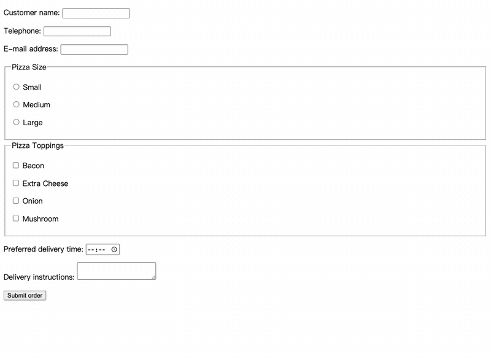

# ego-jev

[](https://skills.sh/ZephyrDeng/ego-jev)
[](https://github.com/ZephyrDeng/ego-jev/releases)
[](LICENSE)

Every step your agent takes on a page costs a full LLM turn — seconds of
reasoning before each click.

When I drive multi-step tasks in ego lite — filling a form, setting filters,
clicking through menus — the agent pauses before every step: read the
snapshot, reason, then act. A ten-step task means ten LLM turns. Then I saw
[jev-ultrafast](https://github.com/browser-use/jev-ultrafast) run the same
kind of loop standalone — Zürich → London on Google Flights in 7.1 s — and
ported that inner loop into ego lite, so the agent keeps your real browser,
your sessions and your logins.

## How it works

ego executes; Jev decides. Each step: snapshot → number the interactive
elements → one [System One](https://docs.typesafe.ai/introduction) call picks
the operation *and* its target in the same request → ego clicks, fills or
selects. One decision, one network round trip, ~0.4 s.

```text
@2  textbox   "Customer name"
@5  button    "Apply filters"
d1  div       "member card G18655"
```

Per step: ~300–550 ms for the decision, ~11K input tokens ≈ $0.0005. The
alternative is a full LLM turn — seconds of reasoning plus a screenshot.

What it also does:

- **Finds elements the snapshot misses.** `dN` entries cover `div` cards,
  `cursor:pointer` widgets, iframe and shadow content that never get a11y
  refs — the clickables that usually make a loop give up.
- **Escalates instead of guessing.** Pay, delete, upload, confirm, login
  pages, free text, low confidence and repeated actions all hand control back
  to you, in English and 中文. `done` is a claim; your `verify` decides.
- **Runs without a key.** The bundled selftest drives the loop with a mock
  decider inside ego-browser — same mechanics, nothing to configure.

What it never does: Jev does not type free text, does not read screenshots,
and does not touch login, payment or canvas. Those come back to the agent
that called it.

## Demo

Four Jev decisions on a live form — each step numbers the elements, picks an
operation and target in one call, then ego executes it:



([`docs/demo.mp4`](docs/demo.mp4) for a crisper version.)

## Use

1. Install the skill:

   ```bash
   npx skills add ZephyrDeng/ego-jev
   ```

   Claude Code plugin and `gh skill install ZephyrDeng/ego-jev` work too.

2. Put one backend key in `~/.config/ego-jev/secrets.env`
   (`export NAME=value`):
   - `TYPESAFE_API_KEY` from [console.typesafe.ai](https://console.typesafe.ai)
     — fastest, ~300–550 ms/step, $5 monthly credit without a card, or
   - `AI_GATEWAY_API_KEY` for Jev through the Vercel AI Gateway.

   No key yet? Run the offline selftest, mock decider included:

   ```bash
   cd skills/ego-jev && ego-browser nodejs < scripts/selftest.mjs
   ```

3. In an `ego-browser` script, call the loop on a Page with your goal and a
   `verify` for the real done state:

   ```js
   const { runJevLoop } = await import(`file://${SKILL_DIR}/scripts/jev-loop.mjs`);
   const result = await runJevLoop(page, {
     goal: "Open the Billing page and show the credit balance",
     verify: async (p) => /billing/.test(await p.url()),
   });
   ```

   `result.status` is `done`, `escalate`, `blocked` or `max_steps` — the loop
   fails loud and names the reason. Options, thresholds, backends and latency
   numbers: [`skills/ego-jev/reference.md`](skills/ego-jev/reference.md).

## FAQ

**Do I need anything besides ego lite?**
The `ego-browser` agent skill, which you already have if your agent drives
ego lite, plus one key. ego-jev only replaces the per-step "which element"
judgment.

**Does it work on a browser other than ego lite?**
No. It drives ego-browser's TaskSpace/Page API. For a standalone browser
agent with the same loop, see
[jev-ultrafast](https://github.com/browser-use/jev-ultrafast).

**Will it type my search query / reply text?**
It fills only values you pass in via `values`, picking fields by your hints.
A fill with no matching value escalates instead of inventing data. Free text
is planner work.

**What does a step cost?**
≈ 11K input tokens ≈ $0.0005 on the direct TypeSafe backend; output is free.

## Related

- [browser-use/jev-ultrafast](https://github.com/browser-use/jev-ultrafast) —
  the standalone browser agent this loop is ported from
- [TypeSafe docs](https://docs.typesafe.ai/introduction) — the Jev /
  System One decision API
- [ego lite](https://lite.ego.app/) — the Chromium browser for humans and
  agents this skill drives

## License

[MIT](LICENSE)
