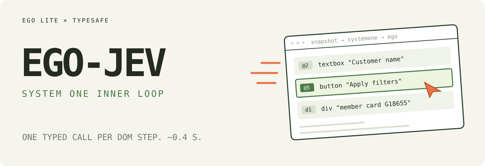
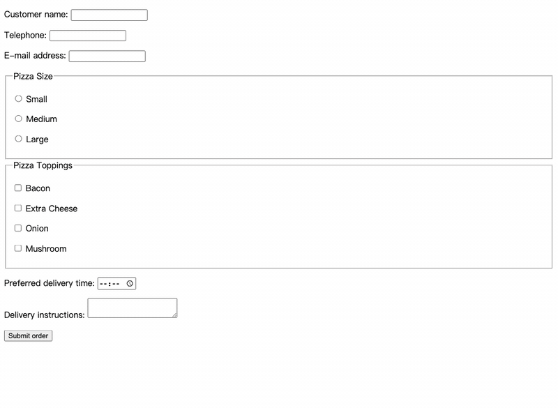

# ego-jev

[](https://skills.sh/ZephyrDeng/ego-jev)
[](https://github.com/ZephyrDeng/ego-jev/releases)
[](LICENSE)

Every step your agent takes on a page costs a full LLM turn — seconds of
reasoning before each click.

When I drive multi-step tasks in ego lite — filling a form, setting filters,
clicking through menus — the agent pauses before every step: read the
snapshot, reason, then act. A ten-step task means ten LLM turns. Then I saw
[jev-ultrafast](https://github.com/browser-use/jev-ultrafast) run the same
kind of loop standalone — Zürich → London on Google Flights in 7.1 s — and
ported that inner loop into ego lite, so the agent keeps your real browser,
your sessions and your logins.

## How it works

ego executes; Jev decides. Each step: snapshot → number the interactive
elements → one [System One](https://docs.typesafe.ai/introduction) call picks
the operation *and* its target in the same request → ego clicks, fills or
selects. One decision, one network round trip, ~0.4 s.

```text
@2  textbox   "Customer name"
@5  button    "Apply filters"
d1  div       "member card G18655"
```

Per step: ~300–550 ms for the decision, ~11K input tokens ≈ $0.0005. The
alternative is a full LLM turn — seconds of reasoning plus a screenshot.

Measured on a 7-step form task (3 runs, all verified, ~5.5 s wall): Jev
decides in a median ~270 ms. One bare LLM call over the same snapshot takes
~1.0 s (Haiku 4.5), ~1.4 s (Sonnet 4.5) or ~2.8 s (GPT-5 mini), before any
agent overhead. Method and raw data: [`docs/bench`](docs/bench/README.md).

What it also does:

- **Finds elements the snapshot misses.** `dN` entries cover `div` cards,
  `cursor:pointer` widgets, iframe and shadow content that never get a11y
  refs — the clickables that usually make a loop give up.
- **Escalates instead of guessing.** Pay, delete, upload, confirm, login
  pages, free text, low confidence and repeated actions all hand control back
  to you, in English and 中文. `done` is a claim; your `verify` decides.
- **Checks configuration before browser work.** A safe preflight resolves
  credentials without a model request. Missing credentials pause Jev before
  browser work; the agent asks once about secure local setup, an existing
  configuration location or plain ego-browser for the same user goal.
- **Records what happened, only if you ask.** Opt-in `record` captures the
  XHR/fetch requests each step triggered plus a cookie before/after diff, with
  headers, bodies and cookie values off and query tokens redacted by default.
  The agent asks before the first run; off unless you say yes.

What it never does: Jev does not type free text, does not read screenshots,
and does not touch login, payment or canvas. Those come back to the agent
that called it.

## Demo

This author demo illustrates the mechanics. Ordinary tasks use the user's
goal, URL/existing Page and supplied values; ask a minimal clarification if
the goal or starting target is missing. Run examples or demos only when the
user explicitly requests a test/demo, including when no backend key is set.

Four Jev decisions on a live form — each step numbers the elements, picks an
operation and target in one call, then ego executes it:



([`docs/demo.mp4`](docs/demo.mp4) for a crisper version.)

## Use

1. Install the skill:

   ```bash
   npx skills add ZephyrDeng/ego-jev
   ```

   Claude Code plugin and `gh skill install ZephyrDeng/ego-jev` work too.

2. Put one backend key in `~/.config/ego-jev/secrets.env`
   (`export NAME=value`):
   - `TYPESAFE_API_KEY` from [console.typesafe.ai](https://console.typesafe.ai)
     — fastest, ~300–550 ms/step, $5 monthly credit without a card, or
   - `AI_GATEWAY_API_KEY` for Jev through the Vercel AI Gateway.

3. In `ego-browser nodejs`, run preflight **before** creating a TaskSpace or
   navigating a Page. It uses the same credential lookup as the real backend
   and returns only readiness, route and safe guidance, never the key:

   ```js
   const { preflightJev } = await import(`file://${SKILL_DIR}/scripts/jev-loop.ts`);
   const backendOptions = {}; // use the task's supplied options, if any
   const ready = await preflightJev(backendOptions);
   if (ready.ok) {
     console.log({ ...ready, next: "continue_jev" });
   } else {
     console.log({ ...ready, next: "pause_jev" });
   }
   ```

   Handle `ready.ok: false` by pausing the Jev branch and asking the user once
   whether they want to configure a TypeSafe / Vercel key securely on this
   machine, can identify an existing configuration location, or prefer plain
   ego-browser. Never request or print a plaintext key or automatically
   change real configuration. While awaiting the answer, create no TaskSpace
   or Page, navigate no Page, make no model request and do not poll or retry.
   If the user has already explicitly refused configuration or selected the
   fallback, reuse that choice without asking again. Continue fallback with
   the same user goal, URL/Page, supplied values and any existing TaskSpace
   and ownership; do not switch to an author test page.

   When the user says a key already exists or is now configured, use the
   supported [lookup](skills/ego-jev/reference.md#backend-and-keys) without
   exposing its value. Recreate any cached `makeAsk` instance or use fresh
   backend options, then rerun preflight in the actual `ego-browser nodejs`
   runtime; shell configuration alone may not reach it. Continue to step 4
   only after `ready.ok: true`; otherwise keep Jev paused and report safe
   guidance without repeating the question or busy waiting. Preflight checks
   key resolvability, not real Jev availability or key validity.

4. Create/resume the task's one TaskSpace and starting Page under the
   `ego-browser` ownership rules, using the user's target. Bind `userGoal`,
   `providedValues` and `verifyUserGoal` from that task, then call the loop:

   ```js
   const { runJevLoop } = await import(`file://${SKILL_DIR}/scripts/jev-loop.ts`);
   const result = await runJevLoop(page, {
     ...backendOptions,
     goal: userGoal,
     values: providedValues,
     verify: verifyUserGoal,
   });
   ```

   Add `record: true` to also get `result.record` (requests per step, cookie
   diff); see [Record](skills/ego-jev/reference.md#record-opt-in).

   `result.status` is `done`, `escalate`, `blocked` or `max_steps` — the loop
   fails loud and names the reason. Options, thresholds, backends and latency
   numbers: [`skills/ego-jev/reference.md`](skills/ego-jev/reference.md).

   The loop also preflights before any Page/recording operation. Unresolved
   credentials return `escalate`, `steps: 0` and no model calls or retry wait.
   Handle that result with step 3's one-time question rule.
   On task success, follow `ego-browser`'s `finish({ keep })` cleanup rules.

## Maintenance tests

Run tests or author demos only for an explicit test/demo request; they are
never a default task or a fallback for missing credentials. `npm test` and
`npm run typecheck` are local regression gates using mocked Pages/network.

The bundled selftest uses scripted mock decisions and needs no Jev key, but
requires a real ego-browser connection, creates a TaskSpace, visits
`https://httpbin.org/forms/post` and changes that page. It is not offline and
does not validate real Jev credentials, service availability or latency.
For that explicitly requested browser test only:

```bash
cd skills/ego-jev && ego-browser nodejs < scripts/selftest.mjs
```

See [maintenance test boundaries](skills/ego-jev/reference.md#maintenance-tests).

## FAQ

**Do I need anything besides ego lite?**
The `ego-browser` agent skill, which you already have if your agent drives
ego lite, plus one key. ego-jev only replaces the per-step "which element"
judgment.

**Does it work on a browser other than ego lite?**
No. It drives ego-browser's TaskSpace/Page API. For a standalone browser
agent with the same loop, see
[jev-ultrafast](https://github.com/browser-use/jev-ultrafast).

**Will it type my search query / reply text?**
It fills only values you pass in via `values`, picking fields by your hints.
A fill with no matching value escalates instead of inventing data. Free text
is planner work.

**What does a step cost?**
≈ 11K input tokens ≈ $0.0005 on the direct TypeSafe backend; output is free.

## Related

- [browser-use/jev-ultrafast](https://github.com/browser-use/jev-ultrafast) —
  the standalone browser agent this loop is ported from
- [TypeSafe docs](https://docs.typesafe.ai/introduction) — the Jev /
  System One decision API
- [ego lite](https://lite.ego.app/) — the Chromium browser for humans and
  agents this skill drives

## License

[MIT](LICENSE)
